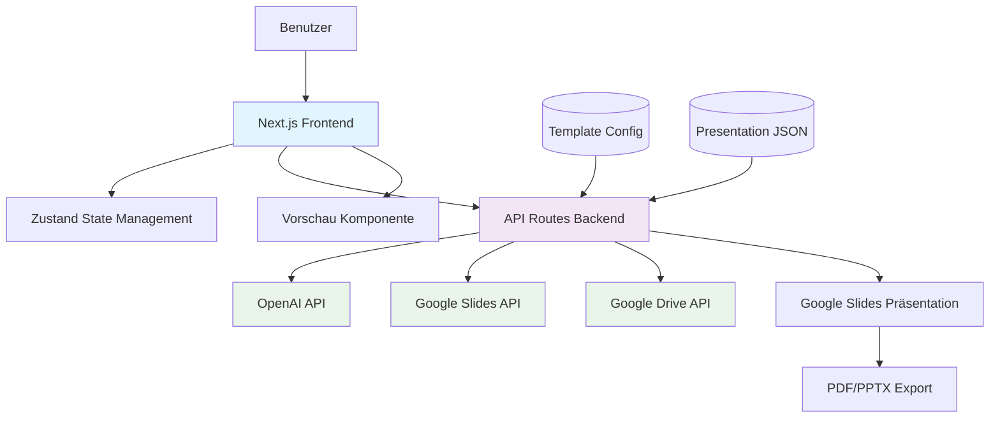

# Architekturdokument: AI Slides Generator

## 1. Übersicht

Das AI Slides Generator ist eine Next.js-basierte Webanwendung zur automatischen Generierung professioneller, gebrandeter Präsentationen aus Themenvorgaben mittels KI. Die Anwendung integriert OpenAI für die Inhaltsgenerierung und Google Slides API für die Präsentationserstellung.

## 2. Systemarchitektur



### 2.1 Komponentenübersicht

- **Frontend**: Next.js 14+ mit TypeScript, Tailwind CSS für Styling, Zustand für State Management
- **Backend**: Next.js API Routes für serverseitige Logik
- **Externe APIs**: OpenAI GPT-4, Google Slides/Drive APIs
- **Template-System**: JSON-basierte Template-Konfiguration (z.B. Techeroes Modern Template)

## 3. Frontend-Architektur

### 3.1 Technologie-Stack

- **Framework**: Next.js 14+ (App Router)
- **Sprache**: TypeScript
- **Styling**: Tailwind CSS
- **State Management**: Zustand
- **UI-Komponenten**: Custom Components mit Tailwind

### 3.2 Hauptkomponenten

#### PresentationForm

- Eingabefelder für Thema, Folienanzahl, Stil, Template-Auswahl
- Formularvalidierung mit React Hook Form
- Integration mit Zustand für State-Verwaltung

#### SlidePreview

- Anzeige generierter Folien als Thumbnails
- Lazy Loading für Performance
- Interaktive Navigation zwischen Folien

#### ExportButtons

- Buttons für Google Slides Link, PDF, PPTX Export
- Ladezustände und Fehlerbehandlung
- Download-Links generieren

#### LoadingIndicator

- Globale Ladezustände während API-Calls
- Progress-Indikatoren für mehrstufige Prozesse

### 3.3 State Management

```typescript
interface AppState {
  formData: {
    topic: string;
    slideCount: number;
    style: string;
    templateId: string;
  };
  generatedSlides: Slide[];
  isGenerating: boolean;
  exportUrls: {
    googleSlides?: string;
    pdf?: string;
    pptx?: string;
  };
}
```

## 4. Backend-Architektur

### 4.1 API-Routen

#### POST /api/generate-json

- **Input**: `{ topic, slideCount, style, templateId }`
- **Prozess**: OpenAI API Call für JSON-Generierung
- **Output**: Presentation JSON Schema
- **Error Handling**: Rate Limiting, API-Quota Checks

#### POST /api/create-presentation

- **Input**: `{ presentationJson, templateId }`
- **Prozess**: Google Slides API Integration
- **Output**: `{ presentationId, googleSlidesUrl }`
- **Template Mapping**: JSON zu Google Slides Layouts

#### GET /api/export/:id/:format

- **Input**: presentationId, format (pdf|pptx)
- **Prozess**: Google Drive API Export
- **Output**: Download-URL oder direkter Stream

#### GET /api/templates

- **Output**: Array verfügbarer Templates
- **Caching**: In-Memory Cache für Template-Configs

### 4.2 Externe Integrationen

#### OpenAI Integration

- **Modell**: GPT-4 mit Structured Output
- **Prompt Engineering**: Template-spezifische Prompts
- **Fallback**: Error Handling bei API-Ausfällen

#### Google APIs

- **Authentifizierung**: OAuth 2.0 Service Account
- **Scopes**: Slides, Drive (readonly für Export)
- **Rate Limiting**: Exponential Backoff

### 4.3 Sicherheit

- **API Keys**: Environment Variables
- **Rate Limiting**: 5 Requests/minute pro IP
- **Input Validation**: Zod Schemas
- **Error Logging**: Structured Logging mit Winston

## 5. Datenmodelle

### 5.1 Presentation JSON Schema

```typescript
interface Presentation {
  title: string;
  theme: string;
  slides: Slide[];
}

interface Slide {
  type: "title" | "content" | "image" | "chart" | "big_number";
  layout: string;
  content: {
    title?: string;
    body?: string[];
    image?: ImageData;
    chart?: ChartData;
  };
}
```

### 5.2 Template Configuration

```typescript
interface TemplateConfig {
  id: string;
  name: string;
  branding: {
    colors: Record<string, string>;
    fonts: Record<string, string>;
    logos: Record<string, string>;
  };
  layouts: Record<string, LayoutConfig>;
}
```

## 6. Deployment & Infrastruktur

### 6.1 Hosting

- **Platform**: Vercel oder ähnliche Serverless-Plattform
- **Database**: Keine benötigt (stateless Design)
- **Caching**: Redis für Template-Cache (optional)

### 6.2 Environment Variables

```
OPENAI_API_KEY=sk-...
GOOGLE_CLIENT_EMAIL=...
GOOGLE_PRIVATE_KEY=...
GOOGLE_PROJECT_ID=...
NEXT_PUBLIC_APP_URL=https://...
```

### 6.3 Monitoring

- **Logging**: Vercel Analytics + Custom Error Tracking
- **Performance**: Core Web Vitals Monitoring
- **API Usage**: Dashboard für OpenAI/Google API Quotas

## 7. Risiken & Mitigation

### 7.1 Hohe Priorität

- **OpenAI API Ausfälle**: Fallback zu GPT-3.5, User Notification
- **Google API Quotas**: Rate Limiting, Queue-System
- **Template Komplexität**: Vereinfachte Fallback-Layouts

### 7.2 Mittlere Priorität

- **Performance**: Lazy Loading, Code Splitting
- **Mobile UX**: Responsive Design Testing
- **Export Qualität**: Manuelle QA für verschiedene Templates

## 8. Erweiterbarkeit

### 8.1 Neue Templates

- Template-Registry System
- JSON-Schema Validation
- Hot-Reload für Template-Updates

### 8.2 Zusätzliche Features (Phase 2+)

- Dokument-Upload Integration
- Multi-Language Support
- Admin Panel für Template-Management

## 9. Qualitätssicherung

### 9.1 Testing

- **Unit Tests**: Jest für API-Routen und Utilities
- **Integration Tests**: Playwright für E2E-Tests
- **API Tests**: Supertest für Backend-APIs

### 9.2 Code Quality

- **Linting**: ESLint + Prettier
- **Type Checking**: Strict TypeScript
- **Security**: Dependency Scanning

## 10. Roadmap-Integration

### Phase 1 (MVP)

- Basis-Frontend mit Form und Vorschau
- OpenAI + Google Slides Integration
- 3 Standard-Layouts aus Techeroes Template

### Phase 2

- PDF/PPTX Export
- Erweiterte Layouts (Charts, 2-Spalten)
- Template-System mit 5+ Designs

### Phase 3

- Dokument-Upload
- Multi-Language
- Analytics Dashboard
