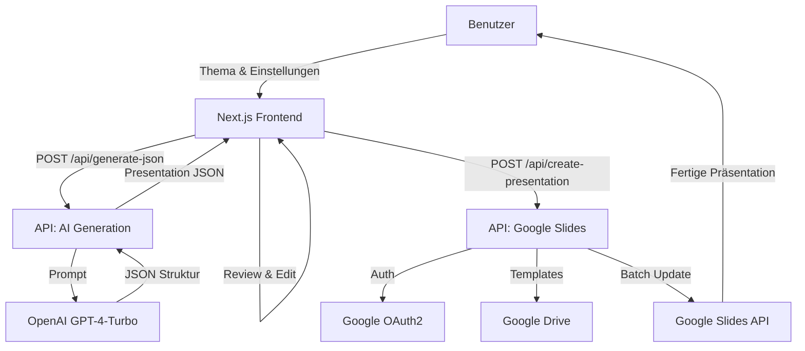

# Technische Dokumentation: AI Slider Generator

## 1. Systemübersicht

Der **AI Slider Generator** ist eine Next.js-basierte Webanwendung, die es Benutzern ermöglicht, durch Eingabe eines Themas automatisch professionelle Google Slides Präsentationen zu generieren. Die Anwendung nutzt OpenAI's GPT-4 für die Inhaltserstellung und die Google Slides API für die Generierung der Folien.

### Architektur-Diagramm (Konzeptuell)



## 2. Technologie-Stack

*   **Framework**: Next.js 16 (App Router)
*   **Sprache**: TypeScript (Strict Mode)
*   **Styling**: Tailwind CSS
*   **Datenbank**: SQLite (via Prisma ORM) - *Migration zu Supabase PostgreSQL vorbereitet*
*   **ORM**: Prisma Client v5
*   **State Management**: Zustand
*   **AI Integration**: OpenAI API (GPT-4-Turbo in JSON Mode)
*   **Google Integration**: Googleapis (Slides v1, Drive v3)
*   **Authentifizierung**: Google OAuth 2.0 (Custom Implementation)

## 3. Kern-Komponenten

### 3.1 Datenbank & ORM (`src/lib/db.ts`)
Die Anwendung nutzt Prisma als ORM.
*   **Modelle**: `User` und `Presentation`.
*   **Singleton**: Der Prisma Client wird als Singleton instanziiert, um Connection-Limit-Probleme im Dev-Mode zu vermeiden.
*   **Speicherort**: Lokal in `./dev.db` (SQLite).

### 3.2 Authentifizierung (`src/lib/user-auth.ts`)
Die Anwendung nutzt einen manuellen OAuth2-Flow. Tokens (Access & Refresh) werden in HttpOnly-Cookies gespeichert.
*   **Wichtig**: Der `getUserAuth()` Helper instantiiert den Google OAuth2 Client für jeden Request neu basierend auf den Cookies.

### 3.2 KI-Generierung (`src/app/api/generate-json`)
*   **Input**: Thema, Slide-Anzahl, Stil.
*   **Verarbeitung**: Ein streng typisierter Prompt wird an `gpt-4-turbo` gesendet.
*   **Sicherheit**: Nutzung von `response_format: { type: "json_object" }` garantiert valides JSON.
*   **Output**: Ein JSON-Objekt, das die Struktur der Präsentation (Titel, Folien, Inhalte) definiert.

### 3.3 Slide-Engine (`src/app/api/create-presentation`)
Dies ist das Herzstück der Anwendung. Sie unterstützt zwei Modi:
1.  **Blank Mode**: Erstellt eine leere Präsentation und baut Folien elementweise auf.
2.  **Template Mode**:
    *   Kopiert ein existierendes Master-Template.
    *   **Smart Duplication**: Wenn mehr Folien angefordert werden als das Template besitzt, wird die Inhaltsfolie (meist Index 1) automatisch dupliziert.
    *   **Placeholder Replacement**: Ersetzt Platzhalter wie `{{TITLE}}`, `{{CONTENT}}` durch die KI-generierten Texte.

## 4. Datenstrukturen

### Presentation JSON
```typescript
interface Presentation {
  title: string;
  theme: string;
  slides: Slide[];
}

interface Slide {
  id: string;
  type: "title" | "content";
  layout: "TITLE_SLIDE" | "TITLE_AND_BODY";
  content: {
    title: string;
    body: string[]; // Liste von Bullet Points
  };
}
```

## 5. API Endpunkte

### `POST /api/generate-json`
Generiert die Struktur der Präsentation.
*   **Body**: `{ topic: string, slideCount: number, style: string }`
*   **Response**: `Presentation` Objekt.

### `POST /api/create-presentation`
Erstellt die physische Google Slide Datei.
*   **Body**: `{ slides: Slide[], templateId?: string }`
*   **Response**: `{ presentationId: string, googleSlidesUrl: string }`

## 6. Setup & Konfiguration

Benötigte Umgebungsvariablen in `.env.local`:

```env
# OpenAI
OPENAI_API_KEY=sk-...

# Google OAuth
GOOGLE_CLIENT_ID=...
GOOGLE_CLIENT_SECRET=...
NEXT_PUBLIC_APP_URL=http://localhost:3000

# Service Account (Optional für Admin-Tasks)
GOOGLE_CLIENT_EMAIL=...
GOOGLE_PRIVATE_KEY=...
```

## 7. Bekannte Limitierungen & Roadmap

*   **Bilder**: Aktuell werden noch keine Bilder generiert oder eingefügt.
*   **Charts**: Platzhalter für Diagramme werden noch nicht unterstützt.
*   **Auth**: Token-Refresh muss client-seitig robust gehandhabt werden (aktuell serverseitig implementiert aber Cookie-Update fehlt teilweise).

## 8. Entwicklung

Projekt starten:
```bash
npm install
npm run dev
```

Tests ausführen:
```bash
npx playwright test
```
