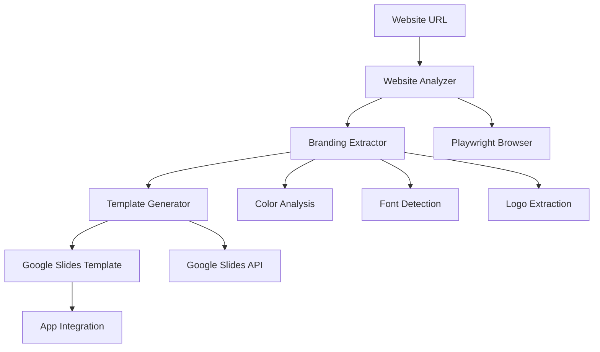

# Automatische Template-Generierung aus Websites

## Übersicht

Das automatische Template-Generierungssystem analysiert Websites und erstellt maßgeschneiderte Google Slides Templates basierend auf dem Branding der Website.

## Architektur

### System-Komponenten



### Datenfluss

1. **Website Analyse**: Playwright lädt und analysiert die Website
2. **Branding Extraktion**: Farben, Fonts und Logos werden extrahiert
3. **Template Generierung**: Google Slides Template wird programmatisch erstellt
4. **Integration**: Template wird in der App verfügbar gemacht

## Technische Spezifikationen

### Website Analyzer

**Verantwortlichkeiten:**
- Website laden und rendern
- DOM-Struktur analysieren
- CSS-Styling extrahieren
- Screenshots erstellen

**Technologien:**
- Playwright für Browser-Automation
- Cheerio für DOM-Parsing
- Puppeteer Screenshot API

### Branding Extractor

**Color Extraction:**
- CSS Color Values analysieren
- Häufigkeitsanalyse durchführen
- Color Palette generieren
- Kontrast-Verhältnisse berechnen

**Font Detection:**
- Google Fonts API Integration
- CSS Font-Family Analyse
- Fallback Font Detection
- Font Stack Optimierung

**Logo Extraction:**
- Image Recognition für Logo-Elemente
- SVG/PNG Logo Detection
- Logo URL Extraktion
- Alt-Text Analyse

### Template Generator

**Google Slides Integration:**
- Programmatische Präsentationserstellung
- Theme Application
- Layout Generation
- Content Platzhalter

**Layout Mapping:**
- Website-Struktur zu Folien-Layouts
- Responsive Design berücksichtigen
- Brand-konsistente Styling

## API Spezifikationen

### POST /api/analyze-website

Analysiert eine Website und extrahiert Branding-Informationen.

**Request:**
```json
{
  "url": "https://example.com",
  "options": {
    "includeScreenshots": true,
    "extractColors": true,
    "extractFonts": true,
    "extractLogo": true
  }
}
```

**Response:**
```json
{
  "url": "https://example.com",
  "brandName": "Example Company",
  "colors": {
    "primary": "#007bff",
    "secondary": "#6c757d",
    "accent": "#28a745"
  },
  "fonts": {
    "heading": "Poppins",
    "body": "Inter"
  },
  "logo": {
    "url": "https://example.com/logo.png",
    "type": "png"
  },
  "screenshots": ["data:image/png;base64,..."]
}
```

### POST /api/generate-template

Erstellt ein Google Slides Template aus Website-Analyse.

**Request:**
```json
{
  "analysisId": "analysis_123",
  "templateName": "Example Template",
  "layouts": ["title", "content", "image", "quote"]
}
```

**Response:**
```json
{
  "templateId": "template_456",
  "googleSlidesId": "1ABC...XYZ",
  "googleSlidesUrl": "https://docs.google.com/presentation/d/1ABC...XYZ/edit"
}
```

## Implementierungsdetails

### Website Analyse Service

```typescript
class WebsiteAnalyzer {
  async analyze(url: string): Promise<WebsiteAnalysis> {
    const browser = await playwright.chromium.launch()
    const page = await browser.newPage()

    await page.goto(url)
    await page.waitForLoadState('networkidle')

    const analysis = await page.evaluate(() => {
      // DOM Analyse
      const colors = extractColors()
      const fonts = extractFonts()
      const logo = findLogo()

      return { colors, fonts, logo }
    })

    await browser.close()
    return analysis
  }
}
```

### Color Extraction Algorithmus

```typescript
function extractColors(): ColorPalette {
  const elements = document.querySelectorAll('*')
  const colorCounts: Map<string, number> = new Map()

  elements.forEach(el => {
    const styles = window.getComputedStyle(el)
    const color = styles.color
    const backgroundColor = styles.backgroundColor

    // Color frequency analysis
    incrementColor(color)
    incrementColor(backgroundColor)
  })

  return generatePalette(colorCounts)
}
```

### Google Slides Template Creation

```typescript
class TemplateGenerator {
  async createTemplate(branding: ExtractedBranding): Promise<string> {
    const presentation = await slides.presentations.create({
      requestBody: {
        title: `${branding.brandName} Template`
      }
    })

    // Apply branding theme
    await this.applyBranding(presentation.data.presentationId!, branding)

    // Create layouts
    await this.createLayouts(presentation.data.presentationId!)

    return presentation.data.presentationId!
  }
}
```

## Admin Interface

### Template Management Dashboard

**Features:**
- Website URL Input Feld
- Analyse Progress Anzeige
- Template Preview
- Branding Customization
- Publish Controls

**UI Components:**
- URL Input mit Validation
- Progress Bar für Analyse
- Color Picker für Branding Anpassung
- Template Gallery
- Action Buttons (Generate, Edit, Delete)

## Qualitätssicherung

### Test Cases

1. **Website Analyse Tests**
   - Verschiedene Website-Typen
   - SSL/Non-SSL URLs
   - JavaScript-heavy Sites
   - Image-heavy Sites

2. **Branding Extraktion Tests**
   - Color Accuracy
   - Font Detection
   - Logo Recognition
   - Edge Cases (fehlende Assets)

3. **Template Generierung Tests**
   - Google Slides API Integration
   - Layout Consistency
   - Branding Application
   - Error Handling

### Performance Benchmarks

- **Analyse Zeit**: < 30 Sekunden
- **Template Generierung**: < 60 Sekunden
- **API Response Time**: < 5 Sekunden
- **Memory Usage**: < 512MB

## Sicherheit & Compliance

### Data Privacy
- Keine Speicherung sensibler Website-Daten
- Temporäre Analyse-Ergebnisse
- Secure API Communication

### Rate Limiting
- Website Analyse: 10/minute pro User
- Template Generierung: 5/minute pro User
- Google API Quotas berücksichtigen

## Monitoring & Analytics

### Metrics
- Analyse Success Rate
- Template Generation Time
- User Engagement
- Error Rates

### Logging
- Structured Logging für alle Operationen
- Error Tracking mit Stack Traces
- Performance Monitoring
- User Behavior Analytics

## Erweiterungen

### Zukünftige Features
- Multi-Page Website Analyse
- Brand Guideline PDF Generation
- Template Versionierung
- Collaborative Editing
- Advanced AI Branding Analysis

### Integrationen
- Adobe Creative Cloud
- Figma Design System
- Brand Monitoring Tools
- Social Media Brand Analysis